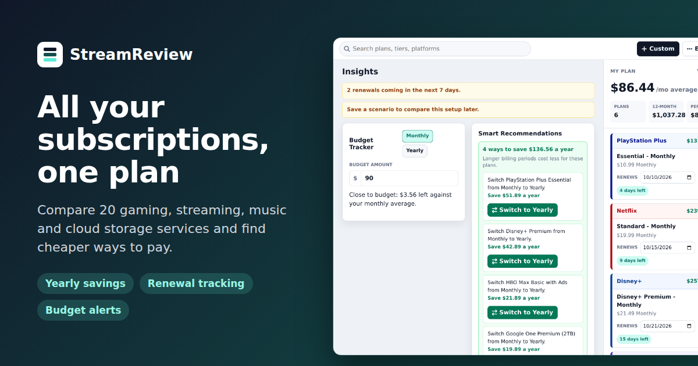

# StreamReview

Plan every subscription in one place. StreamReview compares 20 gaming, streaming video, music and cloud storage services, finds cheaper billing options, and tracks renewals and budgets. It's a static site: everything runs and stays in your browser.

**Live:** https://weaponxd253.github.io/StreamReview/



## Features

- **Browse** plans by category and provider, with per-month costs and "save N% vs monthly" on every billing option.
- **My plan** keeps your totals, renewal dates, budget progress and the next charge in view.
- **Savings** lists every plan that's cheaper on a longer billing period, with one-click switching (or switch them all).
- **Compare** groups plans by category with subtotals and each category's share of your spending.
- **Scenarios** save and compare different setups; export a CSV, a printable report or a JSON backup.
- **Try a sample plan** fills the app with a realistic mix so you can explore it without entering anything.

Open `index.html` directly in a browser to run it locally.

## Commands

```sh
npm run check
npm test
```

## Pricing

Prices are regular U.S. list prices. Each provider in `catalog.js` records when its prices were last checked (`pricesCheckedOn`), and the app shows that date in each plan's details:

- Gaming (PlayStation Plus, Xbox Game Pass, Nintendo Switch Online): checked July 20, 2026.
- Streaming video (Netflix, Disney+, Hulu, HBO Max, Peacock, Paramount+, Apple TV, Prime Video): checked October 6, 2026.
- Music (Spotify, Apple Music, YouTube Premium, Amazon Music Unlimited, Tidal): checked October 6, 2026.
- Cloud storage (iCloud+, Google One, Microsoft 365, Dropbox): checked October 6, 2026.

Introductory offers and trials are shown in plan details, but they are excluded from cost projections. Prime Video with Ultra is priced as the standalone plan plus the Ultra add-on. Amazon Music Unlimited lists the Prime-member and non-Prime prices as separate tiers.

YouTube Premium is listed under both Music and Streaming Video. It is one provider with one set of plans, so a selection shows as selected in both places and is counted once; the music-only YouTube Music Premium tier appears under Music only. Use `alsoIn` on a provider and `categories` on a tier to do the same for other services.

To add a provider, add an entry to `catalog.js` with its category, theme colours, tiers and plans; `npm test` checks the catalog for duplicate ids, missing fields and unsupported billing periods.

The Compare view projects selected plans into monthly, 3-month, and 12-month costs, grouped by category with a 12-month subtotal per category. It doesn't pick a single "best value" across categories, since unrelated services aren't alternatives to each other.

Value per hour counts gaming, streaming and music plans only; cloud storage and other services aren't included.
